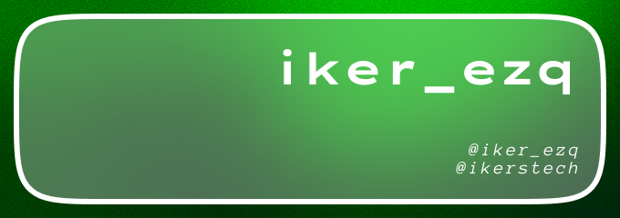

<link rel="preconnect" href="https://fonts.googleapis.com">
<link rel="preconnect" href="https://fonts.gstatic.com" crossorigin>
<link href="https://fonts.googleapis.com/css2?family=Workbench:SCAN@-45&display=swap" rel="stylesheet">

  

<h3 align="center" style="font-family: 'Lexend Giga Bold';">👋 Hello World!</h4>

I'm Iker A coding, UI/UX desing & music enthusiast

---

<table align="center">
  <tr>
    <td align="right">
      <b class="workbench-evenly">./socials</b>
    </td>
    <td>
      
      
      <abbr title="Discord: iker_ezq"></abbr>
      
       
    </td>
  </tr>

  <tr>
    <td align="right"> 
      <b class="workbench-evenly">./apps</b>
    </td>
    <td>
      
      
      
    </td>
  </tr>

  <tr>
    <td align="right">
      <b class="workbench-evenly">./code/languages</b>
    </td>
    <td>
      
      
      
    </td>
  </tr>

  <tr>
    <td align="right">
      <b class="workbench-evenly">./code/languages/learning</b>
    </td>
    <td>
      
      
      
    </td>
  </tr>

  <tr>
    <td align="right">
      <b class="workbench-evenly">./markup/languages</b>
    </td>
    <td>
      
      
    </td>
  </tr>

  <tr>
    <td align="right">
      <b class="workbench-evenly">./os</b>
    </td>
    <td>
      
      
      
      
      
      
    </td>
  </tr>
</table>